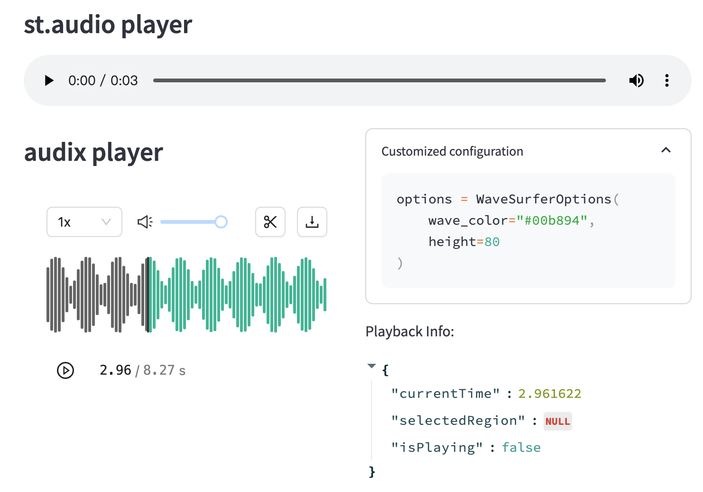
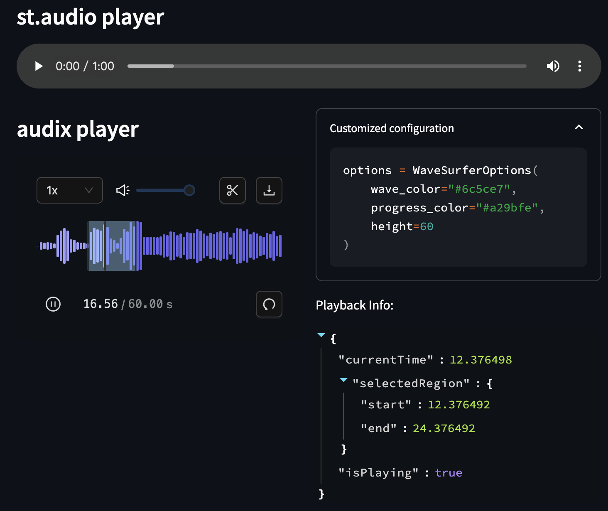
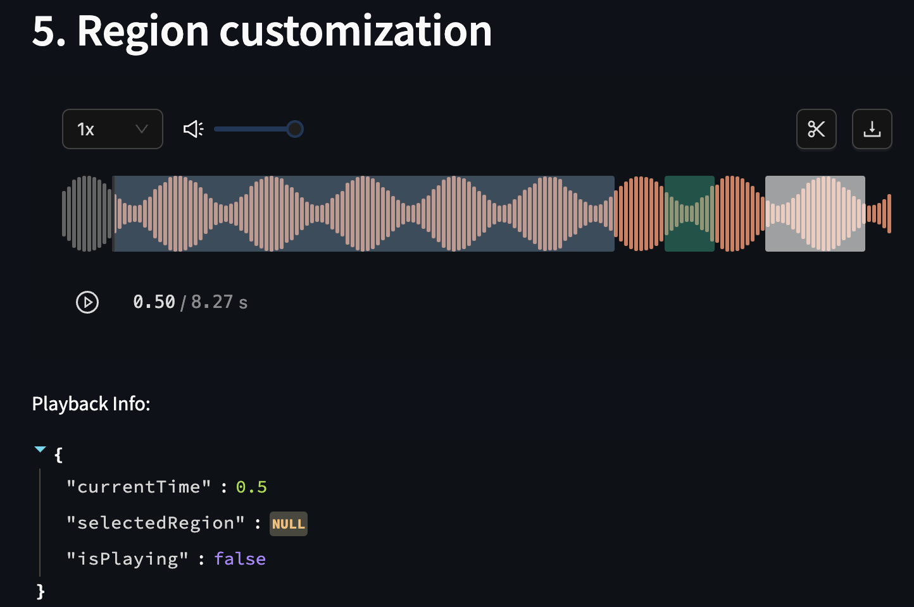

# 🎵 Streamlit Advanced Audio


[](https://pypi.org/project/streamlit-advanced-audio/)
[](https://pypi.org/project/streamlit-advanced-audio/)


[README_CN.md](./README_CN.md)

## Features

While the original `audio` component in Streamlit provides basic audio playback functionality, it lacks advanced features such as style customization and current playback time tracking.

| Feature | audix | st.audio |
|---------|-------|-----------|
| Waveform Visualization | ✅ | ❌ |
| Custom Time Region | ✅ | ❌ |
| Playback Status | ✅ | ❌ |
| Custom Appearance | ✅ | ❌ |
| Multiple Format Support | ✅ | ✅ |
| URL Support | ✅ | ✅ |
| File Upload | ✅ | ✅ |

The `audix` component, built with `react`, `wavesurfer.js`, and `ant design`, offers the following features:

> [!NOTE]
> `audix` means `audio` + `extra`

- [x] Full compatibility with the original `streamlit.audio` component API
- [x] Real-time playback information tracking for audio editing and trimming
  - Current playback time (`currentTime`)
  - Selected region information (`selectedRegion`)
- [x] Modern styling with dark mode support and extensive customization options
  - Waveform color
  - Progress bar color
  - Waveform height
  - Bar width and spacing
  - Cursor styling
- [x] Audio region selection support for quick interval selection and timing
- [x] Support for custom regions style
- [x] Support for custom regions add

❌ Current limitations:

- [ ] Basic URL handling (downloads to local before playback)
- [ ] Experimental trimming feature (requires Python-side processing based on return values)

## More DEMOs







## Installation

Local installation:

```bash
git clone https://github.com/keli-wen/streamlit-advanced-audio
cd streamlit-advanced-audio
pip install -e .
```

PyPI installation:

```bash
pip install streamlit-advanced-audio
```

## Basic Usage

1. Basic playback:

```python
from streamlit_advanced_audio import audix

# Play local file
audix("path/to/your/audio/file.wav")

# Play from URL
audix("https://example.com/audio.mp3")

# Play NumPy array
import numpy as np
sample_rate = 44100
audio_array = np.sin(2 * np.pi * 440 * np.linspace(0, 1, sample_rate))
audix(audio_array, sample_rate=sample_rate)
```

2. Custom waveform styling and playback status get:

```python
from streamlit_advanced_audio import audix, WaveSurferOptions

options = WaveSurferOptions(
    wave_color="#2B88D9",      # Waveform color
    progress_color="#b91d47",  # Progress bar color
    height=100,               # Waveform height
    bar_width=2,             # Bar width
    bar_gap=1                # Gap between bars
)

result = audix(
    "audio.wav",
    wavesurfer_options=options
)

# Get playback status
if result:
    current_time = result["currentTime"]
    selected_region = result["selectedRegion"]
    is_playing = result["isPlaying"]
    st.write(f"Current Time: {current_time}s")
    st.write(f"Is Playing: {is_playing}")
    if selected_region:
        st.write(f"Selected Region: {selected_region['start']} - {selected_region['end']}s")
```

3. Add custom regions and customize regions style:

```python
from streamlit_advanced_audio import audix, CustomizedRegion, RegionColorOptions

# Customize regions style
region_colors = RegionColorOptions(
    interactive_region_color="rgba(160, 211, 251, 0.4)",      # Interactive region color
    start_to_end_mask_region_color="rgba(160, 211, 251, 0.3)" # Start time to end time mask color
)

# 添加自定义只读区域
custom_regions = [
    CustomizedRegion(start=6, end=6.5, color="#00b89466"),     # Use hex color (with transparency)
    CustomizedRegion(start=7, end=8, color="rgba(255, 255, 255, 0.6)") # Use RGBA color
]

result = audix(
    "audio.wav",
    start_time=0.5,
    end_time=5.5,
    mask_start_to_end=True,                    # Show start_time to end_time mask
    region_color_options=region_colors,        # Set region color
    customized_regions=custom_regions          # Add custom read-only region
)
```

4. Set playback interval and looping:

```python
audix(
    "audio.wav",
    start_time="1s",     # Supports various time formats
    end_time="5s",
    loop=True,           # Enable looping
    autoplay=False       # Auto-play setting
)
```

## Development

This project is based on the [Streamlit Component Templates](https://github.com/streamlit/component-template).

For development details, please refer to the [Quickstart](https://github.com/streamlit/component-template?tab=readme-ov-file#quickstart) section.

Here is the development guide:

- Ensure you have Python 3.6+, Node.js, and npm installed.
- Clone this project.
- Create a new Python virtual environment:

```bash
cd streamlit-advanced-audio
python -m venv venv
source venv/bin/activate
pip install streamlit # Install streamlit
```

- Initialize and run the frontend component template:

```bash
cd streamlit-advanced-audio/frontend
npm install    # Install npm dependencies
npm run start  # Start Webpack development server
```

- From another terminal, run the component's Streamlit app (**in development**, set `__init__.py`中的 `_RELEASE` to `False`):

```bash
cd streamlit-advanced-audio
. venv/bin/activate  # Activate your previously created virtual environment
pip install -e . # Install the component package
streamlit run example.py  # Run the component
```

- Modify the frontend code: `streamlit-advanced-audio/frontend/src/`
- Modify the backend code: `streamlit-advanced-audio/__init__.py`

> [!IMPORTANT]
> You can use the following command to build and **lint** the project:
>
> ```bash
> cd streamlit-advanced-audio/frontend
> npm install
> npm run build
> cd ../../
> bash lint.sh # **For** py and tsx code lint.
> ```
>

Pull requests for further improvements are welcome!

## Acknowledgments

This project builds upon several excellent open-source solutions:

- [Streamlit](https://streamlit.io/) for their amazing platform
- [Gradio](https://www.gradio.app/) for inspiration in ML application development
- [Streamlit Component Template](https://github.com/streamlit/component-template) for the component development framework
- [wavesurfer.js](https://wavesurfer-js.org/) for audio waveform visualization
- [wavesurfer Region Plugin](https://wavesurfer.xyz/plugins/regions) for region selection and trimming
- [Ant Design](https://ant.design/) for UI components and dark mode support
