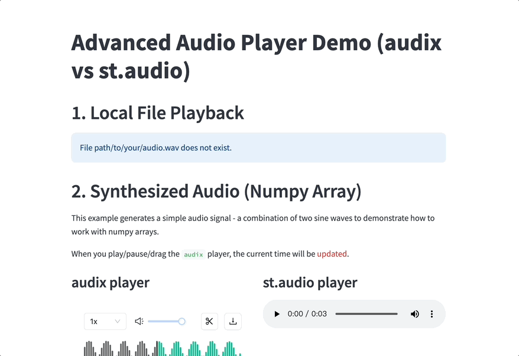
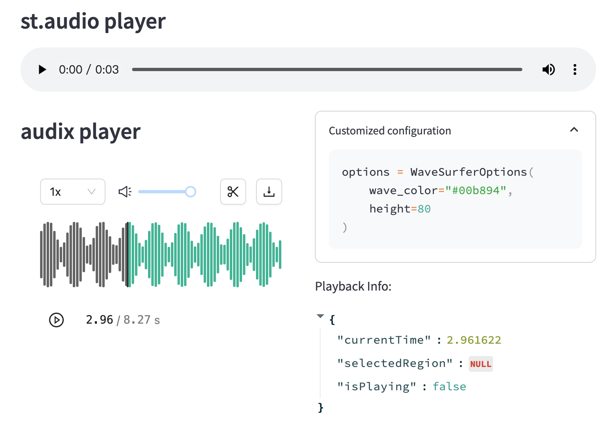
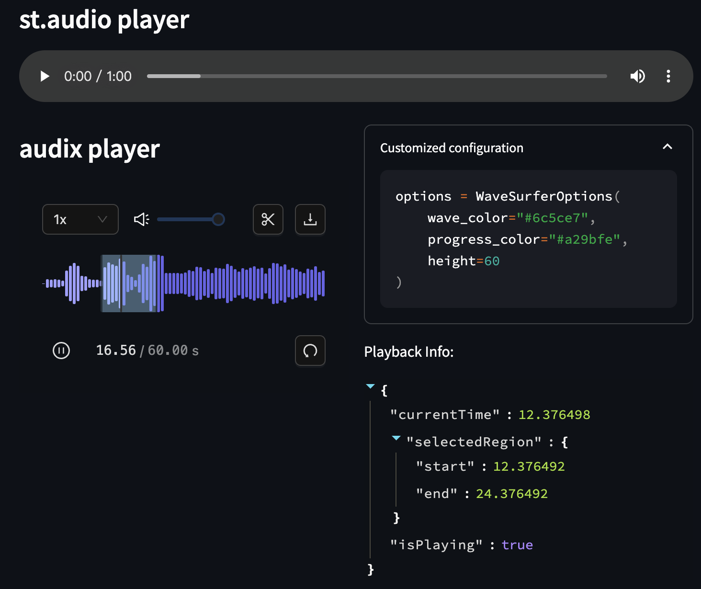
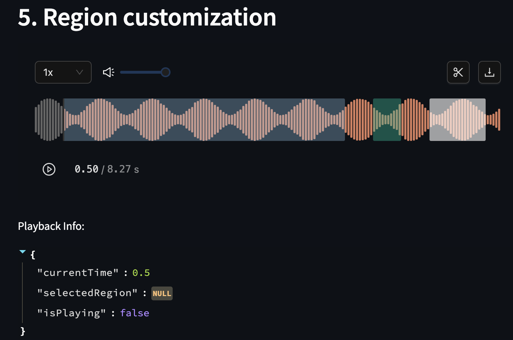

# 🎵 Streamlit Advanced Audio


[](https://pypi.org/project/streamlit-advanced-audio/)
[](https://pypi.org/project/streamlit-advanced-audio/)



[README.md](./README.md)

## 功能与特性

原始 streamlit 中的 `audio` 组件提供了基本的音频播放功能，但是缺乏一些高级的特性，比如缺乏样式定制，无法获取当前播放的时间等。

| Feature | audix | st.audio |
|---------|-------|-----------|
| Waveform Visualization | ✅ | ❌ |
| Custom Time Region | ✅ | ❌ |
| Playback Status | ✅ | ❌ |
| Custom Appearance | ✅ | ❌ |
| Multiple Format Support | ✅ | ✅ |
| URL Support | ✅ | ✅ |
| File Upload | ✅ | ✅ |

`audix` (`audix` 是 `audio` + `extra` 的缩写) 组件基于 `react`，`wavesurfer.js` 和 `ant design` 开发，提供了如下的功能：

- [x] 基本完全兼容了原始 `streamlit.audio` 组件的 API。
- [x] 支持获取当前播放的时间，用于快捷的实现音频切分裁剪等功能。
  - 当前播放时间（`currentTime`）
  - 选中区域信息（`selectedRegion`）
- [x] 使用了更现代的样式，支持黑暗模式也支持高度自定义样式（颜色大小等）。
  - 波形颜色
  - 进度条颜色
  - 波形高度
  - 条形宽度和间距
  - 光标样式
- [x] 支持了音频区间的设定，可以快速获取音频的区间起始时间。
- [x] 支持了自定义的区域颜色。
- [x] 支持添加自定义的区域。

❌ 目前可能存在的不足之处：

- [ ] 对于 url 的处理比较粗糙，会先下载到本地再播放。
- [ ] 裁剪功能仅停留在实验阶段，需要在 python 端基于返回值进行裁剪。

## 更多 DEMO

可参考: [advanced-audio-example.streamlit.app](https://advanced-audio-example.streamlit.app/)







## 安装与使用

从本地安装：

```bash
git clone https://github.com/keli-wen/streamlit-advanced-audio
cd streamlit-advanced-audio
pip install -e .
```

从 PyPI 安装：

```bash
pip install streamlit-advanced-audio
```

## 基础使用示例

1. 基本播放功能：

```python
from streamlit_advanced_audio import audix

# 播放本地文件
audix("path/to/your/audio/file.wav")

# 播放URL音频
audix("https://example.com/audio.mp3")

# 播放NumPy数组
import numpy as np
sample_rate = 44100
audio_array = np.sin(2 * np.pi * 440 * np.linspace(0, 1, sample_rate))
audix(audio_array, sample_rate=sample_rate)
```

2. 自定义波形样式以及播放状态获取：

```python
from streamlit_advanced_audio import audix, WaveSurferOptions

options = WaveSurferOptions(
    wave_color="#2B88D9",      # 波形颜色
    progress_color="#b91d47",  # 进度条颜色
    height=100,               # 波形高度
    bar_width=2,             # 条形宽度
    bar_gap=1                # 条形间距
)

result = audix(
    "audio.wav",
    wavesurfer_options=options
)

# 获取播放状态
if result:
    current_time = result["currentTime"]
    selected_region = result["selectedRegion"]
    isPlaying = result["isPlaying"]
    st.write(f"当前播放时间: {current_time}秒")
    st.write(f"是否正在播放: {isPlaying}")
    if selected_region:
        st.write(f"选中区域: {selected_region['start']} - {selected_region['end']}秒")
```

3. 自定义区域及颜色：

```python
from streamlit_advanced_audio import audix, CustomizedRegion, RegionColorOptions

# 自定义区域颜色
region_colors = RegionColorOptions(
    interactive_region_color="rgba(160, 211, 251, 0.4)",      # 交互式区域颜色
    start_to_end_mask_region_color="rgba(160, 211, 251, 0.3)" # start_time 到 end_time 的蒙版颜色
)

# 添加自定义只读区域
custom_regions = [
    CustomizedRegion(start=6, end=6.5, color="#00b89466"),     # 使用十六进制颜色（带透明度）
    CustomizedRegion(start=7, end=8, color="rgba(255, 255, 255, 0.6)") # 使用 RGBA 颜色
]

result = audix(
    "audio.wav",
    start_time=0.5,
    end_time=5.5,
    mask_start_to_end=True,                    # 显示 start_time 到 end_time 的蒙版
    region_color_options=region_colors,        # 设置区域颜色
    customized_regions=custom_regions          # 添加自定义只读区域
)
```

自定义区域功能支持：

- 设置交互式区域和蒙版区域的颜色。
- 添加多个只读区域，支持 RGBA 和十六进制（带透明度）颜色格式。
- 通过 `mask_start_to_end=True` 在 start_time 和 end_time 之间显示蒙版。

4. 设置播放区间和循环：

```python
audix(
    "audio.wav",
    start_time="1s",     # 支持多种时间格式
    end_time="5s",
    loop=True,           # 循环播放
    autoplay=False       # 自动播放
)
```

## 进一步开发

本代码基于 [Streamlit Component Templates](https://github.com/streamlit/component-template) 开发。

具体可以参考关键的章节 [Quickstart](https://github.com/streamlit/component-template?tab=readme-ov-file#quickstart)。

这里给出简易的开发流程：

- 确保你已经安装了 Python 3.6+, Node.js, 和 npm。
- 克隆本项目。
- 创建一个新的 Python 虚拟环境：

```bash
cd streamlit-advanced-audio
python -m venv venv
source venv/bin/activate
pip install streamlit # 安装 streamlit
```

- 初始化并运行组件模板的前端：

```bash
cd streamlit-advanced-audio/frontend
npm install    # 安装 npm 依赖
npm run start  # 启动 Webpack 开发服务器
```

- 从另一个终端，运行组件的 Streamlit 应用（在开发时注意将 `__init__.py` 中的 `_RELEASE` 设置为 `False`）：

```bash
cd streamlit-advanced-audio
. venv/bin/activate  # 激活你之前创建的虚拟环境
pip install -e . # 安装组件包
streamlit run example.py  # 运行组件
```

- 修改组件的前端代码：`streamlit-advanced-audio/frontend/src/Audix.tsx`。
- 修改组件的 Python 代码：`streamlit-advanced-audio/__init__.py`。

如果你有进一步的优化建议，欢迎提交 PR。

## 感谢

本项目的使用基于许多优秀的开源方案，在此特别感谢：

- [Streamlit](https://streamlit.io/) 提供了如此伟大的产品。
- [Gradio](https://www.gradio.app/) 同样提供了优秀的 ML 应用开发体验。
- [Streamlit Component Template](https://github.com/streamlit/component-template) 快捷的组件开发模板。
- [wavesurfer.js](https://wavesurfer-js.org/) 用于音频波形图的绘制。
- [wavesurfer Region Plugin](https://wavesurfer.xyz/plugins/regions) 用于区间绘制和裁剪。
- [Ant Design](https://ant.design/) 用于 UI 组件和黑暗模式。
